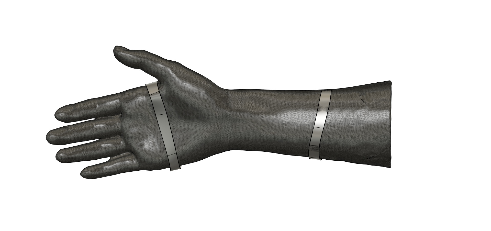
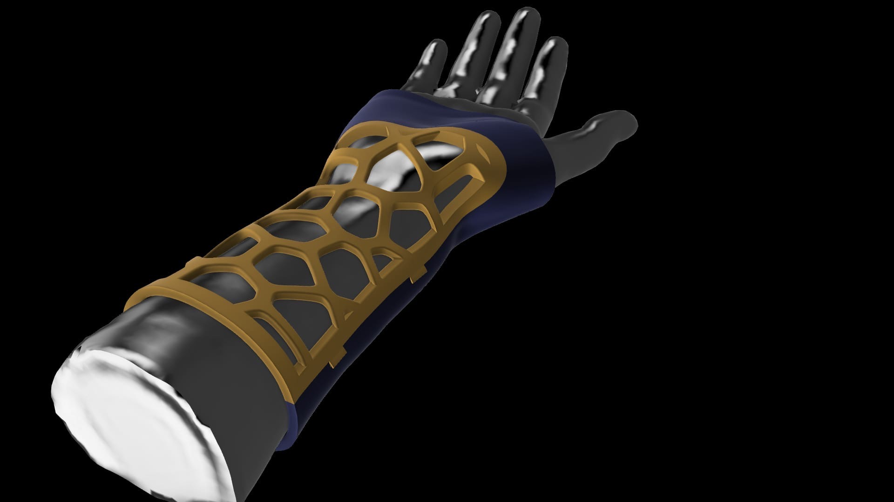

# Orthosis

Fixation of the broken wrist

## Description 
In this project I created 3D-model of fixation for broken hand to prevent motion. For this I used 3D-scan of real hand in .stl format. 
I worked in Fusion 360 to create 3D-model. At pre-work stage, I used 3Ds Max for remeshing 3D-scan file, because it used triangles for initial meshing, but for work it was needed rectangles. In development I used Surface Modelling, as Method for organic design.

## Content
Project contains:
- 3D-model of orthosis in native Fusion 360 extension
- Pictures of work stage

## Task

## In Progress

## Render Pics (Results):

